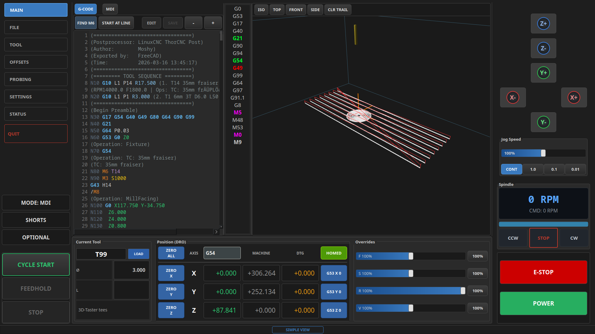
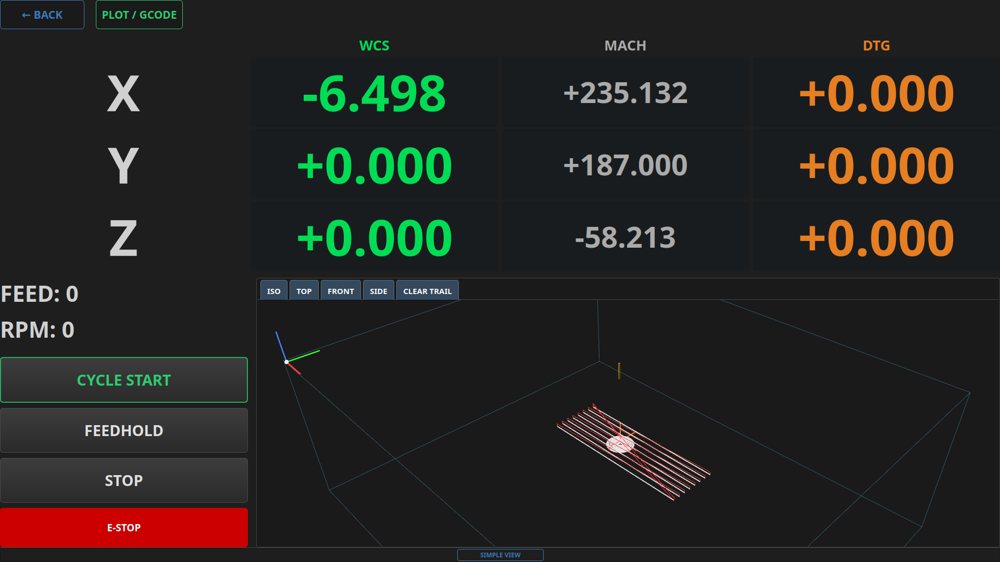
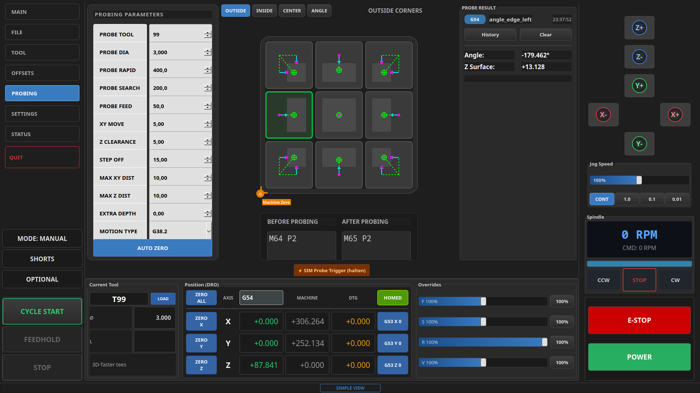
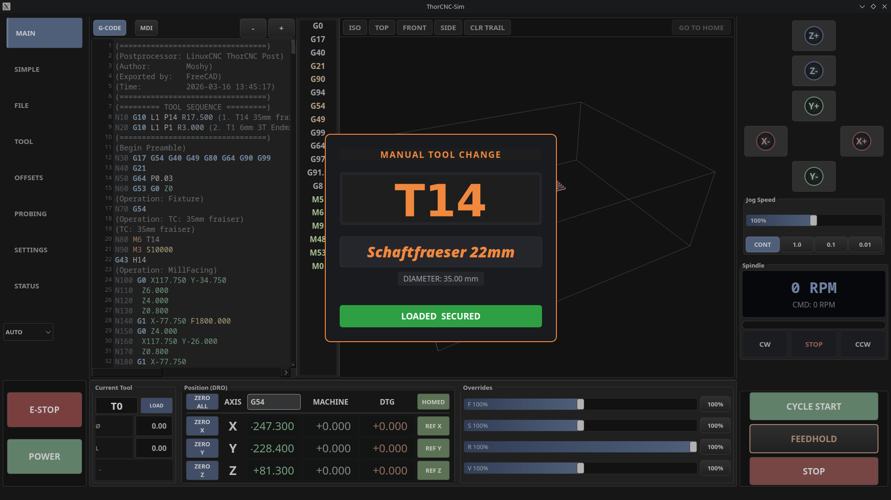

# ThorCNC

> [!CAUTION]
> **PRE-PRE-PRE-ALPHA VERSION — WORK IN PROGRESS**
>
> This project is a **pre-pre-pre-alpha** version and **not intended for productive or machine use** on real CNC machines. 
> 
> **Use at your own risk.** The author takes no responsibility for any damage to hardware, software, or persons. This software should currently be used **only in simulation (Sim) for testing and experimentation**.

---

A modern LinuxCNC graphical interface (VCP) for 3-axis milling machines, built with PySide6 and no additional framework overhead.


---






---

## Features

- **Industrial M6 Dialog** — Premium, touch-optimized manual tool change interface with automatic tool data lookup (Comment, Diameter, Offset).
- **Dynamic G53 Shortcuts** — Optional conversion of homing buttons into G53 X0/Y0/Z0 navigation controls after homing, with a built-in Z-axis safety interlock (XY moves only active when Z is at 0).
- **Industrial Abort Handler** — Integrated support for a custom `ON_ABORT_COMMAND` to safely retract and reset the machine on program interruption.
- **Smart G-Code Editor** — Syntax-highlighted viewer with integrated "Find M6" search, "Edit" mode toggle, and state-aware "Save" button.
- **Status Bar Highlights** — Customizable, color-coded G and M code display in the status bar for improved operator awareness.
- **Probe Warning** — High-visibility visual feedback in the status bar when probe inputs or digital outputs (M64) are active.
- **3D Backplot** — OpenGL-accelerated toolpath visualization via pyqtgraph, with real-time tool position, live trail, and machine envelope display.
- **GO TO HOME** — Toolbar button with color feedback: red = not homed / machine off, green = homed + machine on, gray = AUTO mode.
- **Machine Mode** — Combobox in the left panel to switch between MANUAL / AUTO / MDI.
- **DRO** — Digital readout for work (G54–G59.3) and machine coordinates, with per-axis zero and reference buttons.
- **OFFSETS Tab** — Full WCS table (G54–G59.3) with values read live from the `.var` file.
- **Tool Table** — Editable tool table with diameter and length, live-updated after M6 tool changes.
- **Simple View** — High-visibility minimalist dashboard for distance monitoring, featuring oversized DROs and status indicators.
- **Settings** — Organized sub-tabs for Toolsetter, UI (themes + font sizes), Machine (Abort logic + Homing), and Advanced.
- **Themes** — Dark (default), light, dark_green, dark_orange — switchable at runtime.

---

## Requirements

| Dependency | Version |
|---|---|
| Python | ≥ 3.11 |
| LinuxCNC | ≥ 2.9 (with Python bindings) |
| PySide6 | ≥ 6.5 |
| pyqtgraph | ≥ 0.13 *(optional, for 3D backplot)* |
| PyOpenGL | ≥ 3.1 *(optional, for 3D backplot)* |

Supported distributions: **Debian 13 Trixie**, **Arch Linux**, **CachyOS**, **EndeavourOS**, **Manjaro**

---

## Installation

### Automatic (recommended)

```bash
git clone https://github.com/Moshkopp/thorcnc.git
cd thorcnc
./install.sh
```

For development (editable install — changes take effect immediately):

```bash
./install.sh --dev
```

Uninstall:

```bash
./install.sh --uninstall
```

### Update

Pull the latest changes and reinstall without deleting the folder:

```bash
./update.sh
```

In development mode:

```bash
./update.sh --dev
```

### Manual

```bash
pip install "PySide6>=6.5" pyqtgraph PyOpenGL
pip install .
```

---

## Usage

```bash
thorcnc --ini /path/to/machine.ini
```

With theme:

```bash
thorcnc --theme dark_green --ini /path/to/machine.ini
```

For development against the simulation config included in this repo:

```bash
linuxcnc configs/sim/thorcnc_sim.ini
```

---

## INI Configuration

ThorCNC is set as the display in your LinuxCNC INI file:

```ini
[DISPLAY]
DISPLAY = thorcnc
```

### Required INI Settings

To enable all industrial features, ensure your machine INI file contains the following entries:

#### 1. UI Loading & Persistence
```ini
[DISPLAY]
DISPLAY = thorcnc
# Required for persistent settings like themes, font sizes, and homing behavior
PREFS_FILE = config.prefs
```

#### 2. Industrial Abort Handler
To use the safe retraction logic when stopping a program, define an `ON_ABORT_COMMAND`:
```ini
[RS274NGC]
ON_ABORT_COMMAND = O<on_abort> call
# Ensure ThorCNC can find the O-word subroutines
SUBROUTINE_PATH = subroutines:../../nc_files/subroutines
```

#### 3. M6 Tool Measurement Remap
If you have a tool length sensor, you can enable automatic tool measurement on every tool change:
```ini
[RS274NGC]
REMAP = M6 modalgroup=6 ngc=messe
```

Without the remap, ThorCNC falls back to the standard `hal_manualtoolchange` dialog and reads tool geometry directly from the tool table.

---

## Project Structure

```
thorcnc/
├── main.py             # Entry point, argument parsing
├── mainwindow.py       # Main controller — connects UI to LinuxCNC
├── thorcnc.ui          # Qt Designer UI layout
├── status_poller.py    # QTimer-based LinuxCNC stat polling, emits Qt signals
├── gcode_parser.py     # Lightweight G-code parser for backplot preview
├── settings.py         # Persistent settings (JSON)
├── widgets/
│   ├── backplot.py     # 3D OpenGL backplot widget (pyqtgraph)
│   └── gcode_view.py   # Syntax-highlighted G-code viewer
configs/
└── sim/                # Ready-to-run simulation configuration
```

---

## Architecture

ThorCNC connects directly to LinuxCNC via the official Python bindings (`linuxcnc.stat`, `linuxcnc.command`, `linuxcnc.ini`) without any intermediate framework. A `QTimer`-based poller detects state changes and emits Qt signals, keeping the UI fully decoupled from the polling logic.

The backplot uses a `GLViewWidget` subclass (`_ThorGLView`) to implement custom mouse behaviour, and exposes a `toolbar_layout()` API so the main window can inject buttons directly into the widget — avoiding Qt's OpenGL context destruction that occurs when re-parenting a `QOpenGLWidget`.

---

## License

GPL-2.0-or-later — see [LICENSE](LICENSE)
